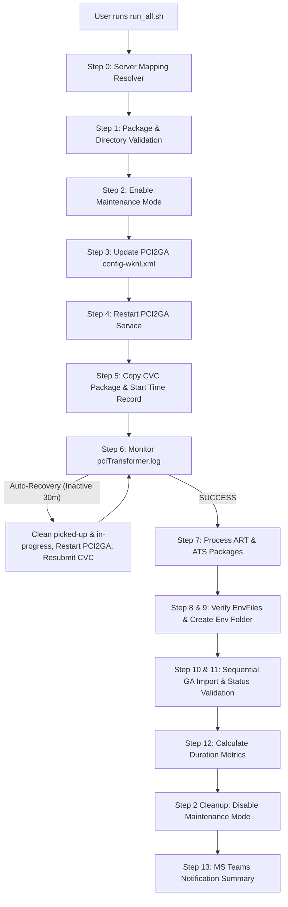
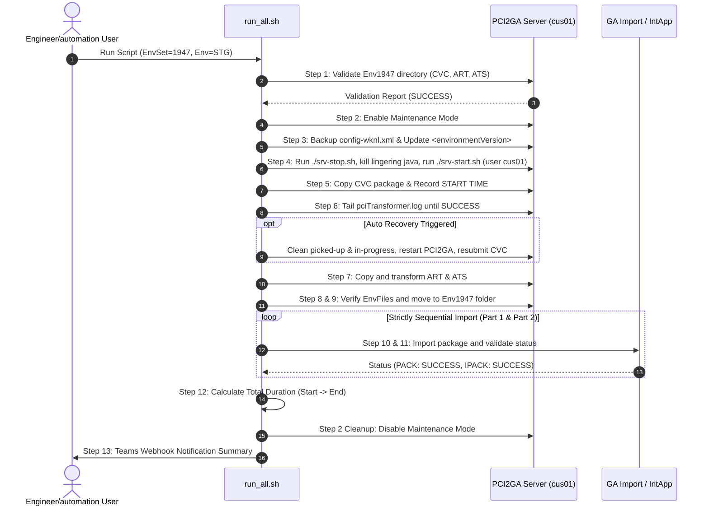

# Wolters Kluwer Global Architecture - EnvSet Integration Architecture Document

## Executive Summary
This document defines the Solution Architecture and DevOps Engineering Design for the automated **Environment Fileset (EnvSet) Integration**. The automation script executes all steps end-to-end for Wolters Kluwer Global Architecture EU environments (**STG** and **PROD**).

---

## 1. High-Level Architecture Diagram

---

## 2. Server Mapping & System Matrix

| Environment | Server Name | IP Address | CDC Reporter URL | PCI2GA URL | Config Path |
|---|---|---|---|---|---|
| **STG** | `wkgaeuslpci2ga01` | `10.73.144.124` | `http://10.73.144.124:8080/cdc/packages` | `http://10.73.144.124:8085` | `/ftp/WKNL-LTR/input/staging/config/Env{number}` |
| **PROD** | `wkgaeuplpci2ga01` | `10.85.129.147` | `http://10.85.129.147:8080/cdc/packages` | `http://10.85.129.147:8085` | `/ftp/WKNL-LTR/input/production/config/Env{number}` |

---

## 3. End-to-End Sequence Diagram

